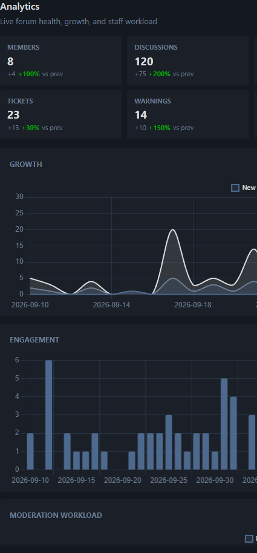

# Analytics

Advanced admin analytics for Flarum 2 — KPIs and Chart.js dashboards beyond core Statistics.

Compatible with **Flarum 2.0**.

## Screenshot



## What it does

- Admin **Analytics** page with 7 / 30 / 90 day ranges
- KPI cards: members, discussions, posts, likes, reports, tickets, warnings, trade, pending backlog
- Charts: growth, engagement, activity mix, moderation workload, report/ticket breakdowns, trade mix, top tags
- Soft-detects **prm-moderation**, **prm-trade-feedback**, and **flarum/likes** (charts hide if missing)
- Dashboard mini widget (replaces the core Statistics widget)

Uses Flarum admin theme colours (`--primary-color`, `--control-bg`, etc.).

## Install

```bash
composer require prm/analytics
```

Or from VCS:

```bash
composer config repositories.prm-analytics vcs https://github.com/smmpanelscripts1/prm-analytics
composer require prm/analytics:dev-2.x
```

Enable **Analytics**, then:

```bash
php flarum cache:clear
```

## How to use

1. Admin → **Analytics**
2. Switch range (7 / 30 / 90 days) or hit Refresh
3. Optional: disable core **Statistics** if you only want this dashboard

API (admin-only): `GET /api/prm-analytics?range=30d`
